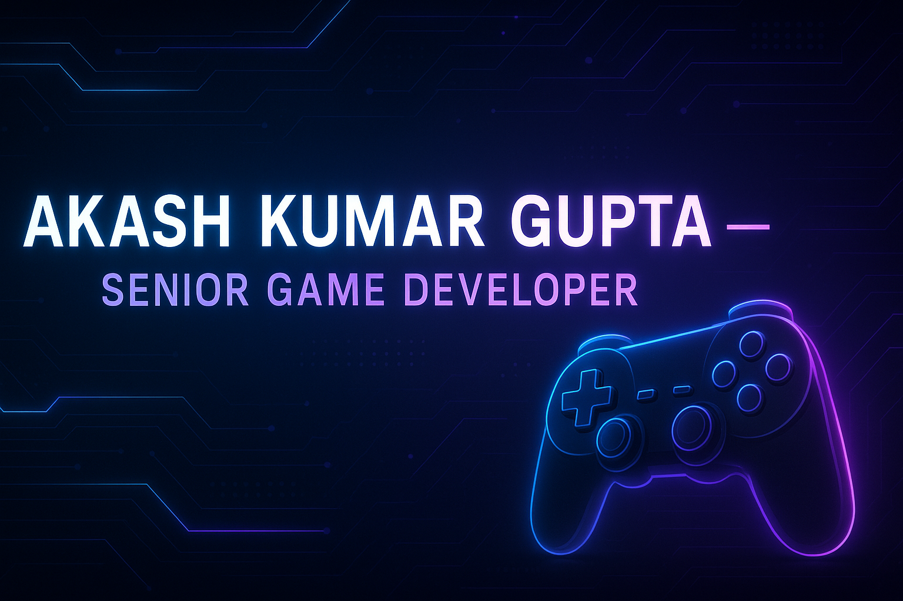

<!-- Banner -->

  

<h1 align="center">🚀 Akash Kumar Gupta</h1>
<h3 align="center">Senior Game Developer | Game Tech Enthusiast | WebGL & 3D Interactive Engineer</h3>

  

---

## ⚡ About Me  
I’m a **Senior Game Developer** with **5+ years of professional experience**, passionate about creating **interactive, fun, high-performance games** across multiple technologies.

I specialize in:
- 🎮 End-to-end **game engineering** (2D, 3D, physics, UI, VFX, gameplay logic)  
- 🌐 **WebGL + React Three Fiber** interactive 3D experiences  
- 🔥 **Cocos Creator** ecosystems (2.x & 3.x)  
- 🧠 Smart systems like word engines, puzzle logic, procedural gameplay  
- 📱 **Cross-platform optimization** (Web/Mobile/Desktop)  
- 🏢 Enterprise-level games for **EdTech, Marketing & Gaming** industries  

I build games that are **fast**, **smooth**, **scalable**, and **pixel-perfect**.

---

## 🚀 Featured Projects  
> A selection of my most technical & impactful work.

### 🔥 **Rocket Mania – Space Shooter (Cocos Creator)**  
A dynamic promotional game featuring:
- Physics-driven rocket controls  
- Asteroid spawning + collision detection  
- Shooting mechanics  
- Leaderboards & reward systems  

🎮 *Playable demo coming soon*

---

### 🧠 **Ludus — Word Tetris (Custom Engine)**  
A unique blend of puzzle + arcade:
- Falling letter physics  
- Rotation, fast-drop, movement  
- Word detection engine (3+ letters)  
- Entirely custom scoring logic  
- Smooth animations + FX  
- Touch-friendly tablet controls  

🛠️ *Tech:* Cocos Creator (TS), Custom Word Engine

---

### ♟ **Online Chess Tournament Platform**  
A **full multiplayer chess ecosystem**:
- Real-time FIDE-rules chess engine  
- Live tournaments (Swiss, Round-Robin)  
- Secure wallet + payments  
- Matchmaking, profiles, chat  
- Admin tools + moderation  

🌐 *Stack:* React, Node.js, PostgreSQL, AWS

---

### 🌌 **React Three Fiber 3D Portfolio**  
A visually stunning interactive 3D portfolio:
- GLB/GLTF model rendering  
- Camera, controls, lighting  
- Scene interactions  
- UI integration  

🛠️ *Tech:* R3F, Three.js, WebGL, React

---

## 🛠 Tech Stack & Tools

### 🎮 Game Engines  

### 🌐 Web Tech  

### 🧩 Programming Languages  

---

## 🧠 Additional Expertise
- 🎨 UI/UX for games & dashboards  
- ⚙️ Performance tuning for 2D/3D  
- 🌱 Procedural generation  
- 🎬 Animation Systems (Tween, Spine, Custom)  
- 🧩 Game Architecture & State Machines  
- 📦 Asset pipelines & optimization  
- 🧪 Debugging + profiling + QA stability  

---

## 🏆 Achievements  
- ✔ Delivered **100+ games** across industries  
- ✔ Built **enterprise-grade** interactive apps  
- ✔ Strong experience with **3D & WebGL performance**  
- ✔ Trusted by global EdTech + Corporates  
- ✔ Specialized in **smooth, polished** gameplay  

---

## 📊 GitHub Stats

  
  

---

## 🔥 Streak Stats

  

---

## 🏅 GitHub Trophies

  

---

## 📈 Activity Graph

  

---

## 🐍 Contribution Snake  

  

---

## 🔗 Connect With Me  
- 💼 **LinkedIn:** https://www.linkedin.com/in/akash-gupta-58b690148/  
- 📧 **Email:** akashkg233@gmail.com  
- 🎮 **itch.io:** Coming soon  
- 🌐 **Portfolio:** Coming soon  

---

## 🤝 Open to Work  
I'm available for:
- Freelance game development  
- Full-time & part-time roles  
- WebGL, R3F, Unity, Cocos projects  
- EdTech, Marketing, and Gaming products  

---

  ⭐ If you enjoy my work, please consider giving my repositories a star!

